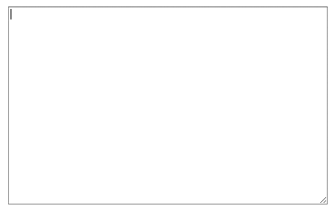

# Textarea with tab indentation

Use tab to indent in textareas (tab got automatically replaced by spaces).


## Installation
```bash
npm i vue-itextarea
```

## Usage
```js
import vue_itextarea from 'vue-itextarea';
Vue.component('vue-itextarea', vue_itextarea);
```

```html
<vue-itextarea v-model="demo"
               class="demo"
               placeholder="Demo"
></vue-itextarea>
```


## License
The MIT License (MIT). Please see [License File](LICENSE.md) for more information.
